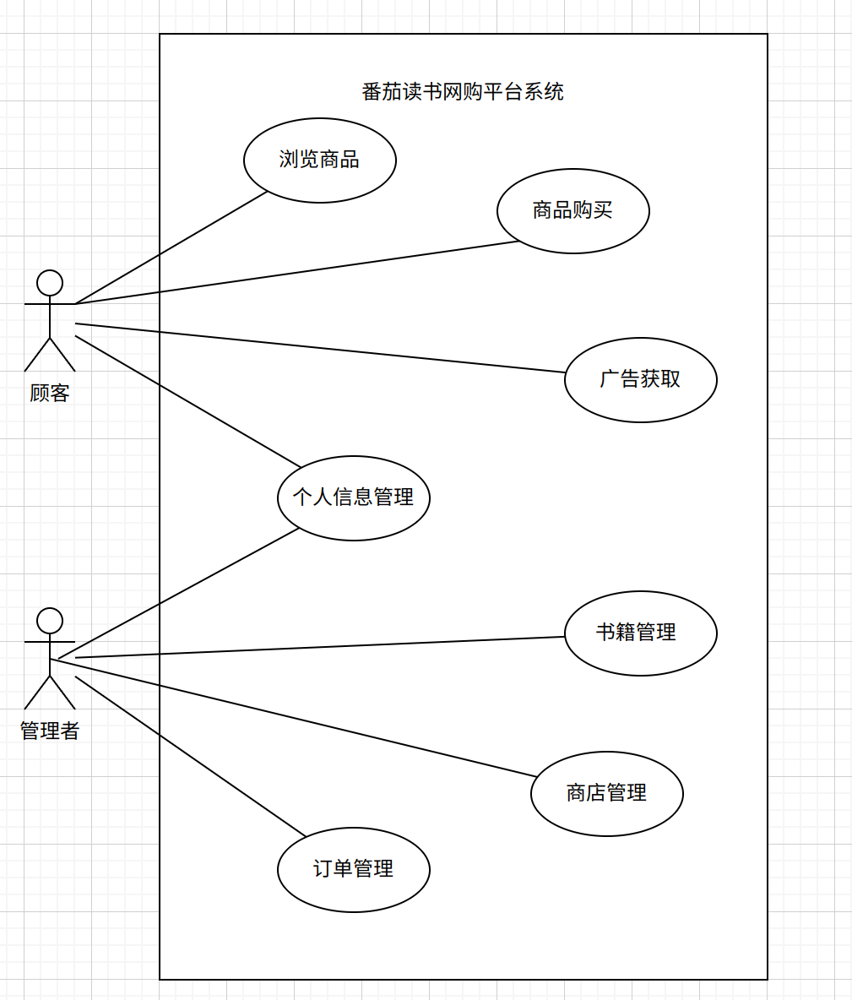

# **用例文档模板**

## **文档作者**

主要编写者：牛一帆 甄翊霖 谢卓凡 李从杨

## **文档修改历史**

| 修改人员 | 日期      | 修改原因     | 版本号 |
| -------- | --------- | ------------ | ------ |
| 牛一帆   | 2025.3.24 | 创建用例文档 | 1.0    |

## **目录**

1. 引言
2. 用例图
3. 用例列表
4. 详细用例描述

## 引言

### **1.1 目的**

本文档描述了 **番茄读书网购平台系统** 的用户需求，为后期开发人员对系统的实现和验证工作提供指导，且面向开发人员、测试人员及最终用户而编写，是了解系统的导航。

### **1.2 阅读说明**

本文档围绕两个主要客户（顾客，管理者）的需求展开用例，大体上组织为用例图，用例列表，详细用例描述三方面，从而全面、完整、详细地进行用例展示，为项目开发的后续阶段奠定良好的基础。

### **1.3 参考文献**

1. 《软件开发的技术基础》丁二玉、刘钦编著
2. 《软件⼯程——实践者的研究⽅法》Roger S. Pressman与Bruce R. Maxim著

## **用例图**

## **用例列表**

| 参与者 | 用例                                                   |
| ------ | ------------------------------------------------------ |
| 顾客   | 个人信息管理 商品浏览 商品购买 广告获取 |
| 管理者 | 个人信息管理 书籍管理 商店管理 订单管理 |

## **详细用例描述**

用例1 个人信息管理

| ID             | 1                                                            |
| :------------- | :----------------------------------------------------------- |
| 名称           | 个人信息管理                                                 |
| 创建者         | 牛一帆                                                       |
| 创建日期       | 2025.3.24                                                    |
| 最后一次更新者 |                                                              |
| 最后更新日期   |                                                              |
| 参与者         | 顾客、管理者                                                 |
| 触发条件       | 参与者想要更新个人信息                                       |
| 前置条件       | 参与者已注册并登录                                           |
| 后置条件       | 用户成功查看个人信息                                         |
| 优先级         | 高                                                           |
| 正常流程       | 参与者使⽤已有帐户登录，或注册新账户  参与者登录后进⼊个⼈信息管理⻚⾯  参与者查看个⼈信息，包括昵称、注册密码、地址等  参与者编辑个⼈信息 系统提示修改成功并更新数据库  参与者确认信息⽆误后退出个⼈信息管理⻚⾯ |
| 扩展流程       | 注册过程中系统提示个人信息填入有误 系统提示注册失败  |
| 特殊需求       | 注册手机号须符合正常格式 系统对密码采取加密措施，保证个人信息的安全性 |

用例2 商品信息创建
| ID             | 2                                                            |
| :------------- | :----------------------------------------------------------- |
| 名称           | 商品信息创建                                                 |
| 创建者         | 李从杨                                                       |
| 创建日期       | 2025.4.1                                                    |
| 最后一次更新者 |                                                              |
| 最后更新日期   |                                                              |
| 参与者         | 管理者                                                  |
| 触发条件       | 参与者想要创建一个新商品                                  |
| 前置条件       | 参与者已注册并登录                                    |
| 后置条件       | 用户成功创建新商品                                           |
| 优先级         | 高                                                           |
| 正常流程       | 参与者已登陆  参与者在顶部导航栏点击"创建商品"  参与者输入与商品相关的信息和上传商品图片  
参与者成功创建商品并跳转到主页  |
| 扩展流程       | 商品信息输入有误 系统提示失败        |
| 特殊需求       | 填写表单需要满足特定的格式                                                           |

用例3 商品信息查看
| ID             | 3                                                            |
| :------------- | :----------------------------------------------------------- |
| 名称           | 商品信息查看                                                 |
| 创建者         | 李从杨                                                       |
| 创建日期       | 2025.4.1                                                    |
| 最后一次更新者 |                                                              |
| 最后更新日期   |                                                              |
| 参与者         | 顾客、管理者                                                  |
| 触发条件       | 参与者想要浏览全部商品或特定商品细节                            |
| 前置条件       | 参与者已注册并登录, 进入主页                                    |
| 后置条件       | 用户成功查看商品信息                                           |
| 优先级         | 高                                                           |
| 正常流程       | 参与者已登陆  参与者进入商店主页  参与者在主页浏览或点击某一特定商品的展示框  参与者获取商品的概览信息  |
| 扩展流程       | 商品图片获取有误 用已提供的默认"崩溃"图代替展示        |
| 特殊需求       | 无                                                           |

用例4 商品信息更改
| ID             | 4                                                          |
| :------------- | :----------------------------------------------------------- |
| 名称           | 商品信息更改                                               |
| 创建者         | 李从杨                                                     |
| 创建日期       | 2025.4.1                                                  |
| 最后一次更新者 |                                                            |
| 最后更新日期   |                                                           |
| 参与者         | 管理者                                                     |
| 触发条件       | 参与者想要修改特定商品的相关信息                              |
| 前置条件       | 参与者已注册并登录, 进入某一特定商品的详情界面                 |
| 后置条件       | 用户成功修改商品信息                                        |
| 优先级         | 高                                                        |
| 正常流程       | 参与者已登陆  参与者进入商店主页  参与者点击某一特定商品的展示框进入详情界面  参与者点击详情界面中的UPDATE或DELETE按钮   使用DELETE按钮删去商品信息并跳转到主页   或者使用UPDATE按钮进入商品信息修改页面(原有信息在输入部分展示)  更改完毕点击修改按钮提交则成功更新并跳转到更新后的该商品详情界面                                                  |
| 扩展流程       | UPDATE中输入信息有误 系统提示失败                 |
| 特殊需求       | 修改信息表单中需要满足要求的特定格式                       /                                                           |